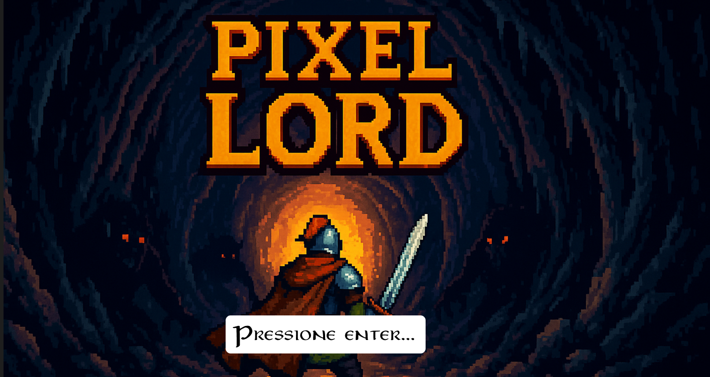

# **Pixel Lord: Chronicles of Eldoria**



---

## 🧙 Sobre o Jogo

**Pixel Lord: Chronicles of Eldoria** é um jogo de ação e fantasia em estilo pixel art, desenvolvido como projeto de conclusão de curso. O jogador assume o papel de um guerreiro lendário que deve atravessar calabouços, enfrentar monstros e derrotar dois chefes finais em duas fases distintas.  

A história se passa em **Eldoria**, um reino devastado por forças sombrias. Você é o último defensor da luz, escolhido para restaurar a paz e destruir os generais do caos: **Boss 1** e **Boss 2**.  

A jornada é cheia de desafios, armadilhas e inimigos com comportamentos distintos e ataques variados. O jogo exige raciocínio rápido, reflexos e domínio dos comandos de ataque e movimentação.

---

## 🎓 Tutorial

Para assistir ao tutorial completo de como jogar, acesse:

🔗 [Tutorial do Pixel Lord - YouTube](https://www.youtube.com/watch?v=SEU_LINK_AQUI)

---

## 🎮 Controles

**Movimentação:**  
- `W` – Andar para cima  
- `A` – Andar para a esquerda  
- `S` – Andar para baixo  
- `D` – Andar para a direita  

**Ataques:**  
- `J` – Ataque leve  
- `K` – Ataque pesado  
- `L` – Ataque à distância (arco)  

---

## ⚙️ Instalação

Para instalar e rodar o jogo localmente:

1. Clone o repositório:
   ```bash
   git clone https://github.com/seu-usuario/pixel-lord.git
   cd pixel-lord
   ```

2. Instale as dependências:
   ```bash
   pip install pygame pytmx
   ```

3. Rode o jogo:
   ```bash
   python main.py
   ```

---

## 🕹️ Como Jogar

- O jogo é dividido em **duas fases**, com mapas distintos e diferentes tipos de inimigos.  
- Enfrente inimigos comuns como **Orcs, Esqueletos e Arqueiros**, cada um com seu comportamento.  
- Derrote o **Boss 1** para avançar à segunda fase, e o **Boss 2** para concluir o jogo.  
- Use seus ataques estrategicamente, pois cada um possui cooldown e dano diferente.  
- Ao derrotar inimigos, você ganha experiência (XP) e evolui o personagem.

---

## 👨‍💻 Créditos

Desenvolvido por:
- **Rafael Fernandes**
- **Maria Fernanda**
- **Nicole Silva**

---

## 🤖 Uso de Inteligência Artificial

Durante o desenvolvimento, utilizamos **modelos de linguagem de IA** para melhorar o código e acelerar o processo de depuração. As ferramentas utilizadas foram:

- **ChatGPT** (modelo GPT-4.5)
- **DeepSeek** (modelo DeepSeek R1)

⚠️ **Importante:**  
O jogo **não foi construído por IA**. As IAs foram usadas exclusivamente como **assistentes** para esclarecer dúvidas, revisar funções com erro e sugerir melhorias. Por exemplo, ao enfrentar um bug em uma função, o código era enviado à IA com perguntas como:  
_"O que está errado nessa função?"_ ou  
_"Como melhorar esse comportamento?"_  

As respostas eram analisadas pela equipe e aplicadas com julgamento crítico.  
Além disso, os **comentários nos códigos foram gerados com IA e revisados por humanos**.

---

## 📦 Dependências

O jogo utiliza as seguintes bibliotecas e módulos:

### Python:
- `pygame`
- `pytmx`

### Bibliotecas padrão:
- `os`
- `math`
- `random`